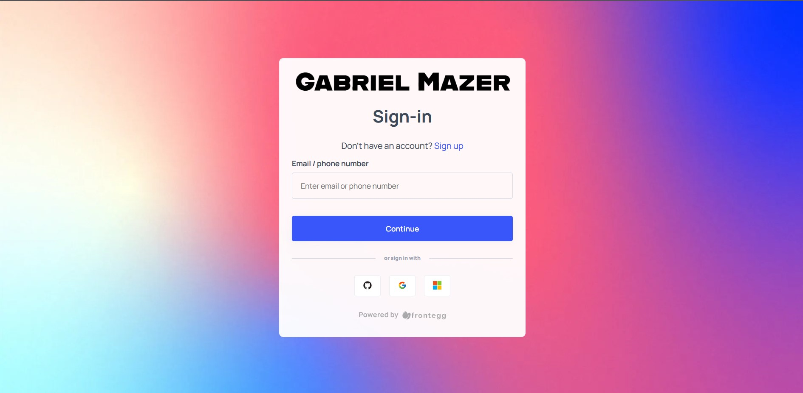

# Frontegg integration

<h1 align="center">
    
</h1>

<h2 id="access">Access Frontegg official website to read the full documentation</h2>

https://frontegg.com/hp

<h2 id="about"></h2> 

Integration of Frontegg with a React application. Should you choose to clone the repository, it will be necessary to create a `contextOptions.ts` file and include your `baseUrl` and `clientId`.
